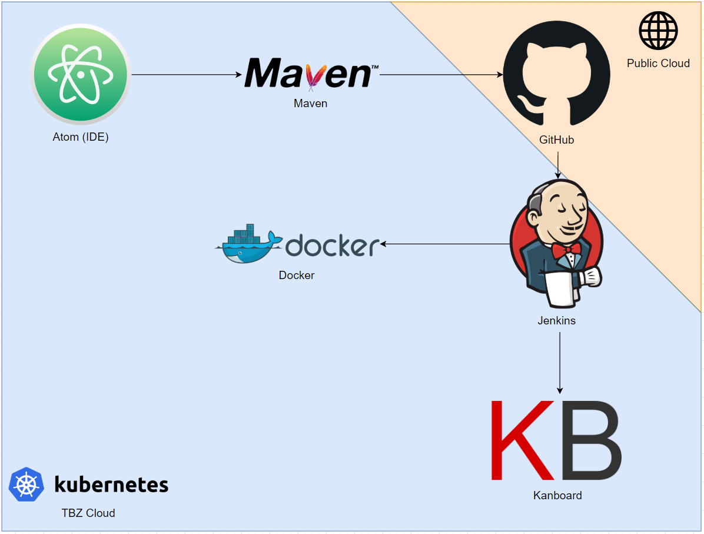
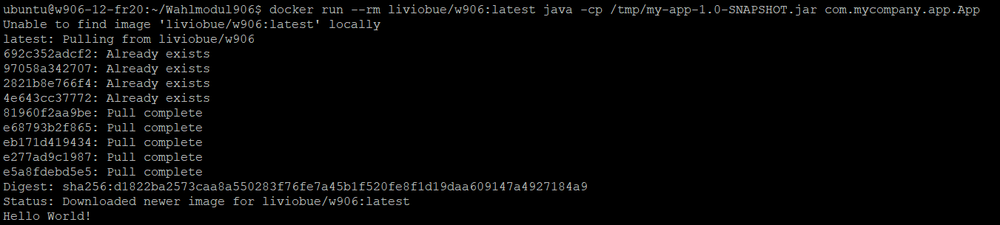

# Wahlmodul 906 Dokumentation LB2
>"Was ist DevOps? Wie funktioniert Kubernetes? Dies und noch vieles mehr werden Sie in den nächsten Seiten erfahren..."

# Table of contents
1. [Einleitung](#Einleitung)
    1. [Anforderungen](#Anforderungen)
    2. [Summary](#Summary)
2. [Planung](#Planung)
    1. [Toolumgebung](#Toolumgebung)
    2. [Tools](#Tools)
3. [Realisation](#Realisation)
    1. [Dienste](#Dienste)
5. [Reflexion](#Reflexion)    
4. [Schluss](#Schluss)

## Einleitung
In dieser Dokumentation werden die Arbeitsschritte und Konfigurationen für eine DevOps-Infrastruktur dokumentiert. Die Dokumentation wird an der Technischen Berufsschule im Rahmen vom Wahlmodul 906 durchgeführt. Mit diesem Projekt haben sich Livio Bürgisser und Leandro Gregorini über 4 Wochen beschäftigt.

### Summary
In einer kurzen Planungsphase haben wir das VPN eingerichtet, DevOps-Tools ausgewählt, und später installiert, sowie konfiguriert und getestet. Damit die gesamte Umgebung auch funktioniert haben wir eine kleines Testprogramm geschrieben, welches den gesamten Durchgang durchläuft.

### Anforderungen
Die Arbeit besteht aus einem Aufbau von einer DevOps-Infrastruktur. Folgende Anforderungen sind vorausgesetzt:
- Eine Toolumgebung für eine DevOps Pipeline einzurichten oder bestehende Cloud Lösungen zu Evaluieren und einzurichten.
- Das Einrichten der Toolumgebung oder die Inbetriebnahme der Cloud Lösung, so zu dokumentieren, dass Dritte diese
nachvollziehen können.
- Ein Beispiel vorzubereiten, welches von der Erstellung der Software bis zur Auslieferung (Delivery) die Pipeline durchläuft


# Planung
## Toolumgebung
Als Basis für alle Programme/Dienste verwenden wir die TBZ-Cloud und Dienste aus der Public Cloud. Für die Evaluation steht uns eine virtuelle Maschine im TBZ Netzwerk zu Verfügung. Wir hatten die IP-Adresse: 192.168.152.12. Die virtuelle Maschine lief mit der Linux-Distribution Ubuntu. Ausserdem war auf der VM bereits Docker und Kubernetes isntalliert.

### Docker
Docker ist eine Containerisierungstechnologie, die die Erstellung und den Betrieb von Applikationen ermöglicht, die man nicht mit virtuellen Maschinen verwechseln sollte. Docker vereinfacht die Bereitstellung von Anwendungen, weil sich Container, die alle nötigen Pakete enthalten, leicht als Dateien transportieren und installieren lassen. Container gewährleisten die Trennung und Verwaltung der auf einem Rechner genutzten Ressourcen. Ein Vorteil ist, dass man diese Container sehr flexibel erstellen, einsetzen, kopieren und zwischen Umgebungen hin- und her verschieben kann. Sogar ein Betrieb in der Cloud ist dadurch möglich und eröffnet viele neue Möglichkeiten. Das Ausführen verschiedener Container bietet zusätzlich einige Sicherheitsvorteile. Wenn man Anwendungen in einem Container ausführt, hat ein Aussenstehender nur Zugriff auf die Ports und Dateien, die der Container explizit freigegeben hat. Wenn man zum Beispiel einen Webserver laufen lassen, muss man zusätzlich die Ports 80/443 öffnen.

### Kubernetes
Kubernetes, auch k8s genannt, oder kurz „kube“ ist eine Open Source-Plattform, die den Betrieb von Linux-Containern automatisiert. Es dient der Orchestrierung von Container-Systemen. Das Tool automatisiert also das Einrichten, Betreiben und auch das Skalieren von containerisierten Anwendungen. Kubernetes ist am Anfang relativ komplex, daher lohnt es sich einen Kurs rund um das Thema Kubernetes zu besuchen.

Folgende Tools verwenden wir in unserer DevOps Umgebung:
## Tools
### Kanboard
- Kanboard (Project Management Software)

Kanboard ist eine kostenlose Open-Source-Projektmanagementsoftware, die sich auf die Kanban-Methodik konzentriert. Es visualisiert Ihre Arbeit klar und einfach, sodass Sie die laufenden Arbeiten einschränken, Projektaufgaben besser verwalten, den aktuellen Status eines Projekts einfach verfolgen und sich auf Ihr Ziel konzentrieren können. Das Tool wurde in der TBZ Cloud installiert. Folgende Aufzählung gehört zu den Tagesaufgaben von Kanboard.
- Visualisieren Sie Ihre Arbeit
- Beschränken Sie Ihre laufenden Arbeiten, um sich auf Ihr Ziel zu konzentrieren
- Ziehen Sie Aufgaben per Drag & Drop, um Ihr Projekt zu verwalten
- Selbst gehostet Super einfache Installation

### Versionsverwaltung
- GitHub

Unser Code wird auf dem Versionalverwaltungstool GitHub verwaltet. Der Service bietet kostenfreie öffentliche Repositories und Collaboration-Funktionen für die Entwicklung von Open-Source-Software. Gleichzeitig können kleine und mittelständische Unternehmen (KMU) gegen eine Gebühr private Repositories und Collaboration-Feature mieten. GitHub ermöglicht Anwendern in seinen öffentlichen Repositories Software zu verändern, anzupassen und weiterzuentwickeln. Jedes Projekt wird als Fork (Abspaltung) bezeichnet. Entwickler können auf GitHub als Team oder allein arbeiten. Öffentliche Nutzer, wie wir, erstellen dafür Profile, welche ihre Respositories und öffentlichen Aktivitäten zeigen. Zudem helfen die Profile Entwicklern beim Finden von Projekten. Den Link zu GitHub finden sie [Hier](https://github.com/).

### Code/Entwicklungsumgebung
- Atom

Den Code selbst haben wir mit der IDE Atom Bei Atom handelt es sich um einen Quelltexteditor von GitHub, mit dem sich unter anderem Programme für die Software-Entwicklungs-Plattform GitHub erstellen lassen. Die integrierte Entwicklungsumgebung oder IDE stellt Programmierern eine Sammlung der wichtigsten Werkzeuge zur Softwareentwicklung unter einer Oberfläche zur Verfügung. Die Arbeit für die Erstellung von Programmen wird dadurch vereinfacht.Für die Arbeit mit Quelltext bietet Atom neben farbigem Syntax-Highlighting auch die Autovervollständigung von eingetipptem Code. Welche Programmiersprache genutzt wird, erkennt Atom dabei anhand der Dateiendung der Quelltext-Datei. Ein Suche ist wie eine Vorschau ebenfalls in Atom zu finden und Code lässt sich in einer Datei oder in mehreren Dateien ersetzen. Mit dem Quelltexteditor kann der Entwickler mehrere Dateien parallel bearbeiten, um Code zu übernehmen oder zu vergleichen. Dazu lässt sich das Editor-Fenster teilen, um die Code-Dateien im Blick zu haben. Zudem bietet Atom einen integrierten Dateimanager, der einzelne Projekt oder mehrere Projekte sowie einzelne Dateien öffnet. Atom ist als Software von GitHub eng mit dem Versionssystem von Git und GitHub verbunden. Somit lässt sich aus dem Editor heraus ein Branch, Commit, Push und Pull durchführen. Dieses Tool wurde auf unseren privaten Laptops installiert.

### Build
- Maven

Maven ist ein Werkzeug um den build-Prozess eines Projektes zu unterstützen. Das Stichwort ist hier Time-To-Market. Das bedeutet ein Build Prozess muss automatisiert ablaufen. Ein solches Werkzeug ist Maven, um in strukturierter Weise eine Build zu erstellen. Das Build-Management-Tool der Apache Software Foundation und basiert auf Java. Mit ihm kann man insbesondere Java-Programme standardisiert erstellen und verwalten

### Continuous Integration (CI)
- Jenkins

Jenkins ist ein in Java programmiertes, Continuous-Integration-System, das bei agiler Softwareentwicklung genutzt wird. Es sorgt dafür, dass kleine Code-Änderungen immer sofort getestet und in die Software eingespielt werden.
- Alle Versionen der einzelnen Entwickler müssen so angepasst werden, dass es keine Inkompatibilitäten gibt und alle Teile reibungslos miteinander funktionieren.
- Damit die Inkompatibilitäten nicht erst kurz vor Schluss des Entwicklungszyklus sichtbar werden, gibt es Jenkins.
- Voraussetzung ist, dass bei der Entwicklung bereits ein Versionskontrollsystem wie Git eingesetzt wird und die Entwickler regelmäßig Ihren Entwicklungszustand einpflegen.
- Jenkins überprüft dann nach jedem Commit oder einfach mehrmals täglich, ob die Software kompiliert und alle Tests besteht.
- Andernfalls benachrichtigt Jenkins das uns über einen Fehler.

### Continuous Deployment (CD)
- Docker

Das schlussendliche Programm haben wir in einem Docker-Container ausgeführt. Dazu haben wir selbst ein Docker Image erstellt.

### REST
REST-API steht für „Representational State Transfer - Application Programming Interface“. Sie macht den Austausch von Informationen möglich, wenn diese sich auf unterschiedlichen Systemen befinden.

# Realisation
## Dienste
Nachdem wir unsere Tools gefunden haben, konnten wir mit der Installation und Konfiguration beginnen. Folgende Grafik zeigt unsere Infrastruktur:


### Schritt 1
ZUerst mus sman das eigentliche Programm schreiben. Dazu nutzen wir die Entwicklungsumgebung Atom. Anhand der Atom Software konnten wir gleich unseren GitHub Account verknüpfen und unser erstelltes Repository verknüpfen.

### Schritt 2
Maven konnten wir mit folgenden Befehlen installieren und bereits ein kleines Java-Testprogramm builden.
```
sudo apt-get install openjdk-8-jdk maven
cd data
mvn archetype:generate -DgroupId=com.mycompany.app -DartifactId=my-app -DarchetypeArtifactId=maven-archetype-quickstart -DarchetypeVersion=1.4 -DinteractiveMode=false
cd my-app/
mvn package
java -cp target/my-app-1.0-SNAPSHOT.jar com.mycompany.app.App
```
Unser Beispiel-Programm gibt einfach "Hello World" aus. Nun haben wir mit unserem Programm den "build"-Prozess abgeschlossen.

### Schritt 3
Im Anschluss haben wir unser Programm auf GitHub hochgeladen. Nun haben wir unser Repositroy mit Jenkins verknüpft. Mit Jenkins haben wir das Programm erfolgreich getestet und integriert. Anhand der REST-API haben wir zudem noch ein Projekt auf Kenboard hinzugefügt. Falls ein Test fehlgeschalgen ist, wird der Benutzer benachrichtigt.
Jenkins und Kenboard laufen in der TBZ Cloud. Diese Tools konnten wir mit den bereits vorhandenen Konfigurationen von Kubernetes benutzen. Wir mussten daher nur noch die entsprechenden "yaml"-Files ausführen. Mit dem Befehl ```kubectl apply -f./jenkins.yaml``` konnten wir das Programm Jenkins in einem Container starten.

Über die REST-API haben wir in Kanboard ein Projekt angelegt.


### Schritt 4
 Anschliessend haben wir zum Ausführen des Programm ein Dockerfile erstellt:
```
FROM ubuntu:latest
RUN apt-get update
RUN export DEBIAN_FRONTEND=noninteractive
RUN apt-get install -q -y -o Dpkg::Options::="--force-confdef" -o Dpkg::Options::="--force-confold" openjdk-8-jdk
RUN apt install -y git
RUN git clone https://github.com/liviobue/Wahlmodul906
RUN cp Wahlmodul906/target/my-app-1.0-SNAPSHOT.jar /tmp
```
Mit folgendem Befehl kann man das Java-Programm ausführen nachdem das Image gebuildet wurde.
```
docker run --rm liviobue/w906:latest java -cp /tmp/my-app-1.0-SNAPSHOT.jar com.mycompany.app.App
```
Wenn alles funktioniert hat, sollte folgende ausgabe erscheinen:


# Reflexion
In unseren Lehrfirmen, haben wir auch bereits mit solchen Tools gearbeitet. Jedoch haben wir noch nie alle miteinader verknüpfet wie in diesem Projekt. Wir haben also das erste mal eine komplette DevOps-Infrastruktur aufbauen können. Es war spannend zu sehen, wie man die einzelnen Dienste miteinander verbinden kann. Wenn man keine der Tools kennt, wird es am Anfang sehr schwer sein. Sobald man die grundsätzlichen Befehle und Abläufe kennt, wird das ganze zu einem Kinderspiel. In diesem Modul haben wir besonders viele neue Programme kennengelernt. Unter anderem Kanboard, Maven, Kubernetes oder die Schnittstelle REST. Wie auch die erste Leistungsbeurteilung hat mir diese Arbeit, durch die viele praktische Arbeit gefallen. Vor allem habe ich in diesem Modul ein richtiges Informatik-Projekt durchführen dürfen. Mit Dokumentation, Praktischer Arbeit und aufwändiger Planung. Zudem haben wir noch unsere Kenntnisse vor und nach dem modul miteinander verglichen.

### Kenntnisse vor dem Modul
|         | Jenkins            | Kanboard         | Maven            | Docker          | Kubernetes            | REST             |
|---------|--------------------|------------------|------------------|-----------------|-----------------------|------------------|
| Livio   | Leichte Kenntnisse | Keine Kenntnisse | Keine Kenntnisse | Gute Kenntnisse | Sehr geringe Kennisse | Keine Kenntnisse |
| Leandro | Keine Kenntnisse | Keine Kenntnisse | Keine Kenntnisse | Gute Kenntnisse | Keine Kennisse | Keine Kenntnisse |

### Kenntnisse nach dem Modul
|         | Jenkins            | Kanboard         | Maven            | Docker          | Kubernetes            | REST             |
|---------|--------------------|------------------|------------------|-----------------|-----------------------|------------------|
| Livio   | Gute Kenntnisse | Gute Kenntnisse | Mittlere Kenntnisse | Gute Kenntnisse | Mittlere Kennisse | Mittlere Kenntnisse |
| Leandro | Gute Kenntnisse | Gute Kenntnisse | Mittlere Kenntnisse | Gute Kenntnisse | Geringe Kennisse | Mittlere Kenntnisse |

Wie man sehen kann hat sich unser Wissensstand in allen Beriechen verbessert. Zum Teil waren die Wissensständ noch sehr tief, diese Lücken konnten nun gefüllt werden.

# Schlusswort
Wir können das Modul mit einem glücklichen Gefühl beenden und unserer neu erlerntes Wissen bestimmt weiter einsetzen. Schlussendlich habe ich aber das Gefühl, dass es für kleine Unternhemen nicht lohnt eine eigene DevOps-Infrastruktur aufzubauen. Diese Firmen sollte lieber auf MIcrosoft Azure, GitHub oder Amazom Services setzen.
